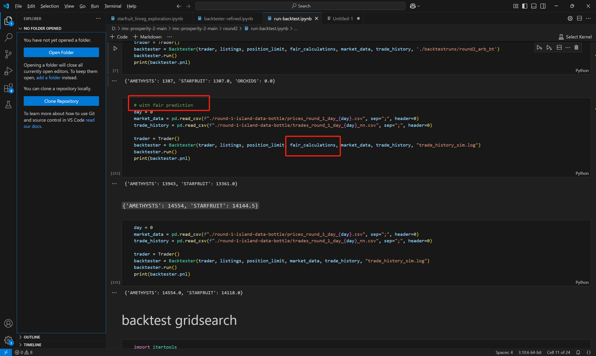

# 框架
1. 跑框架（<https://imc-prosperity.notion.site/Writing-an-Algorithm-in-Python-658e233a26e24510bfccf0b1df647858>）的时候，要在目录下复制一个datamodel.py解决引用问题。
2. 将datamodel的import部分（from datamodel import OrderDepth,TradingState, Order
from typing import List）复制到框架文件开头。

# 回测器的使用方法
1. 点击每一轮文件下的run-backtest.ipynb文件，将原来引进的模块改成现在算法文件的Trader。譬如from round_3 import Trader

2. 改trader，在算法文件里扒拉Product这个类

3. 根据这一环节涉及的产品改listings，其中前两个参数填产品名字，最后一个参数填货币名字。所有信息可以根据官方数据(island-data-bottle)找到。
4. 根据比赛要求改position_limit。
5. 根据算法要求定义计算中间价格的函数，再通过函数返回的结果得到fair_calculations。因此这个参数是否存在需要看算法是否涉及到中间价。

6. 打叉叉的，是我觉得没必要用的代码。可以删掉。
7. 改market_data、trade_history读取的文件路径，定义的file_name必须**以.log结尾**(这样生成的结果才能放到dashborad里分析)

8. 如果这一环节并没有用中间价，则使用下面那一个chunk来运行。

9. 下面那一整块是网格搜索，为了求产品的最优参数用的，这个参数是在算法文件的Product类里定义的。详细看第二点。网格搜索算法是否要使用得问编写算法的相关人员。

# Dashboard
1. 打开dashboard文件夹下的dashapp.py，把522行的app.runserve(debug=True)改成app.run(debug=True)
2. 如运行成功，保持运行并打开网址即可
3. 修改路径为存有日志的文件地址，选择日志

